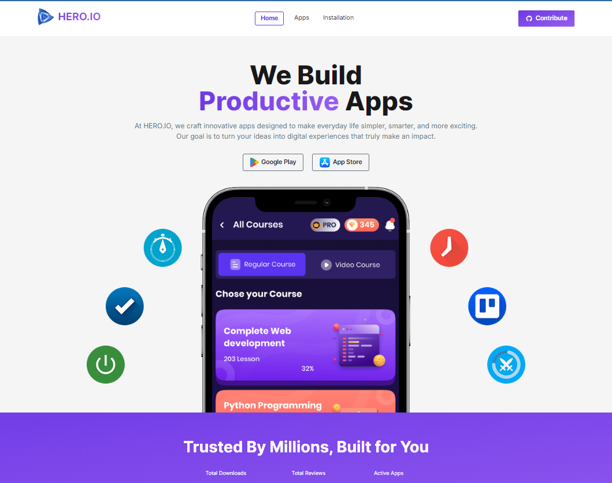
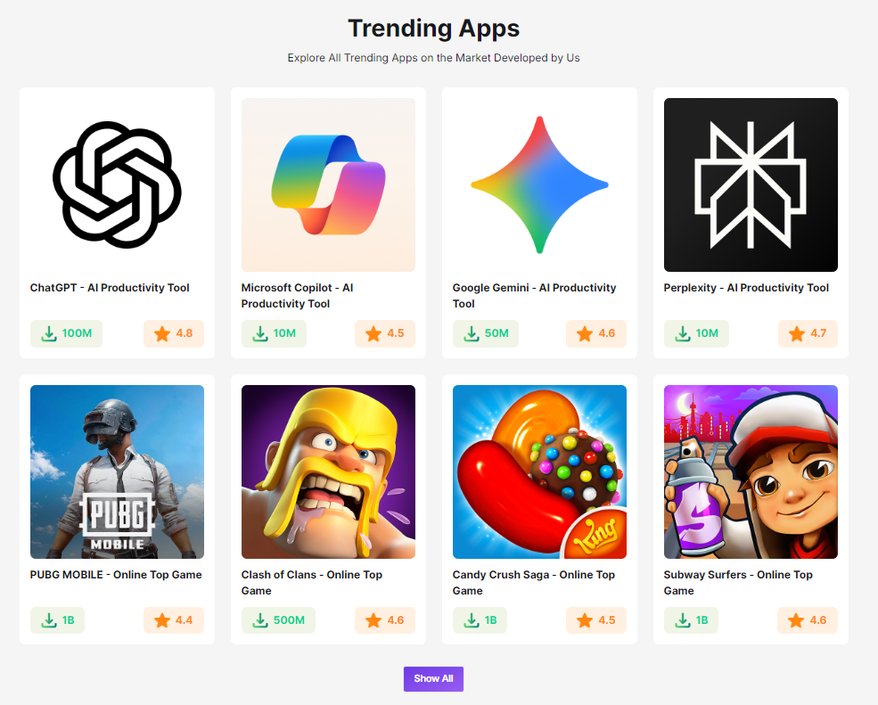
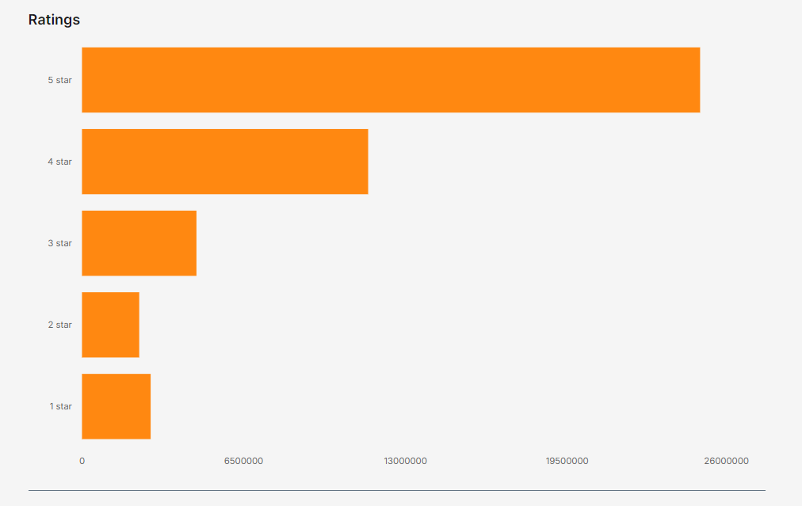
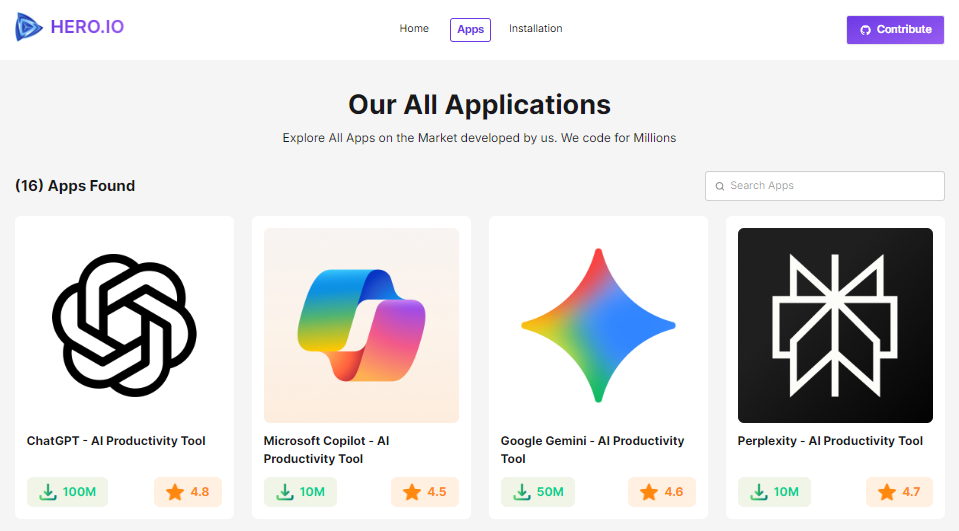
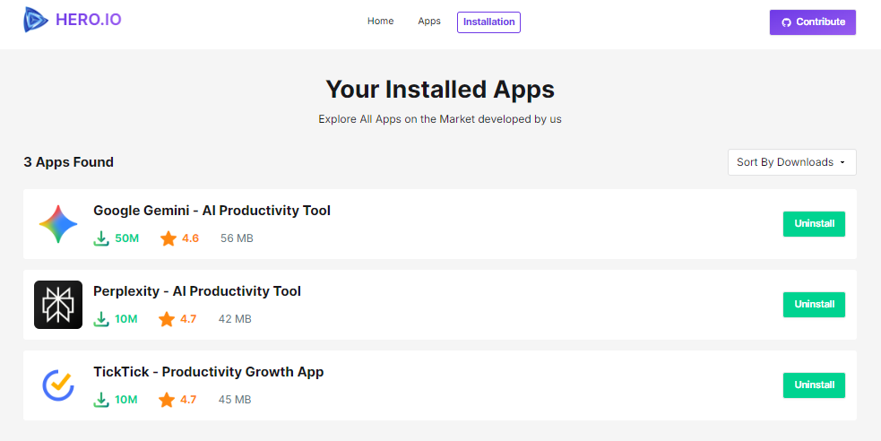

# 🚀 HERO IO

### A platform to showcase innovative and super useful applications developed and maintained by a company.

🌐 **Live Demo:**
https://ahmed-hero-io.surge.sh/

---

# ⚙ Tech Stack

### Frontend

- **React** — Component-based UI development
- **Tailwind CSS** — Utility-first styling
- **DaisyUI** — Reusable UI components
- **Recharts** — Interactive rating statistics
- **Font Awesome** — Icons
- **React Toastify** — Toast notifications

### Routing

- **React Router**
  - Static routes
  - Dynamic routes
  - Nested layouts with `<Outlet>`
  - Individual page titles

### Version Control

- Git
- GitHub

### Deployment

- **Surge**
  - Hosted as a `surge.sh` application
  - SPA page refresh issue resolved

---

# ✨ Key Highlights

✔ Individual page titles for both static and dynamic routes

✔ Global 404 page for invalid routes

✔ Debounced live search functionality

✔ Installation persistence using `localStorage`

✔ Toast notifications for user actions

✔ Interactive rating statistics using Recharts

✔ Active navigation highlighting

✔ Responsive and reusable component architecture

---

# 📷 Screenshots

<p align="center">
  
  
  
</p>

<p align="center">
  
  
  
</p>

# 📌 Core Pages

> Every page has its own title, and invalid URLs are redirected to a global 404 page.

---

## 0. Root Component

Acts as the shared layout for all pages.

### Includes

- Header section
- Navigation bar
  - Company logo
  - GitHub CTA button
  - Navigation links
    - Home
    - Apps
    - Installation

- Active route highlighting
- Footer section
- `<Outlet>` for rendering child pages

---

## 1. Home Page _(Static Route)_

### Hero Section

- CTA to Google Play Store
- CTA to App Store

### Main Section

Displays trending applications using a unified card design.

### Features

- Clicking a card navigates to the corresponding app details page.
- "Show All" button redirects users to the Apps page.

---

## 2. Apps Page _(Static Route)_

Displays all available applications in a unified view.

### Features

- Live search
- Debounced search implementation
- Reusable app card layout
- Custom "App Not Found" component for unmatched searches

---

## 3. App Details Page _(Dynamic Route)_

Provides detailed information about a selected application.

### Features

- Core feature highlights
- App description section
- Install button
- Rating statistics visualization using Recharts

### Installation Flow

When the install button is clicked:

1. The application ID is stored in `localStorage`.
2. Installed applications are tracked persistently.
3. A success toast notification is displayed.

---

## 4. Installation Page _(Static Route)_

Displays all previously installed applications.

### Features

- Installed apps shown in card view
- Highlights core features of each app
- Uninstall functionality
- Removal from `localStorage`
- Toast notification after successful uninstallation

---

# 🏗 Project Architecture

```
Root
│
├── Header
│    ├── Logo
│    ├── Navigation
│    └── GitHub CTA
│
├── Outlet
│    ├── Home
│    ├── Apps
│    ├── App Details
│    ├── Installation
│    └── Global 404
│
└── Footer
```

---

# 🚀 Main Functionalities

- Application browsing
- Dynamic route handling
- Debounced live search
- App installation tracking
- Persistent storage with `localStorage`
- App uninstallation
- Toast-based feedback
- Statistical visualization with bar charts
- Global error handling
- Responsive UI

---

# 📖 Overview

**HERO IO** is a React-based application marketplace that enables users to explore, install, and manage company-maintained applications through a clean and responsive interface. The project demonstrates component-based architecture, dynamic routing, persistent state management using `localStorage`, reusable UI patterns, and interactive data visualization.
